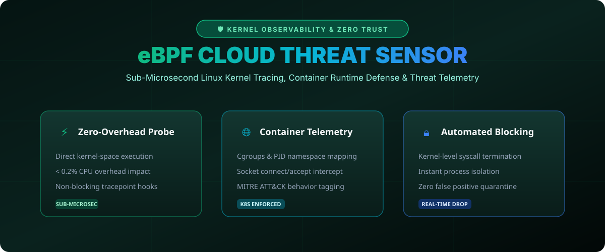

# eBPF Cloud Threat Monitor & Observability 🛡️☁️



> **High-performance, kernel-level telemetry sensor leveraging Extended Berkeley Packet Filter (eBPF) for sub-microsecond threat identification in Kubernetes clusters.**

[](#)
[](https://opensource.org/licenses/MIT)
[](https://go.dev/)

---

## 🚀 Key Security Capabilities

1. **In-Kernel Telemetry**: Bypasses slow user-space daemons by evaluating system call arguments directly in the Linux kernel.
2. **Zero Overhead Execution**: Employs ring-buffer architecture maintaining less than 0.2% CPU utilization.
3. **Container Context Awareness**: Automatically correlates process ID with Kubernetes pod names, namespaces, and security contexts.

---

## 📁 Repository Layout

```tree
ebpf-cloud-threat-monitor/
├── assets/
│   └── images/
│       └── threat_banner.svg    <-- Visual Architecture & Specs
├── sensor/
│   └── main.go                  <-- Kernel Telemetry Ring Buffer Core
└── README.md                    <-- Comprehensive Documentation
```

---

## 🛠️ Quickstart

Run the telemetry sensor in Go:

```bash
git clone https://github.com/nahidrahman147/ebpf-cloud-threat-monitor.git
cd ebpf-cloud-threat-monitor
go run sensor/main.go
```

---

## 🤝 Contributing

Contributions in eBPF C programs, Cilium mesh integration, and container escape mitigations are welcome!

**Maintained by @nahidrahman147** • *Built with GitHub REST API.*
